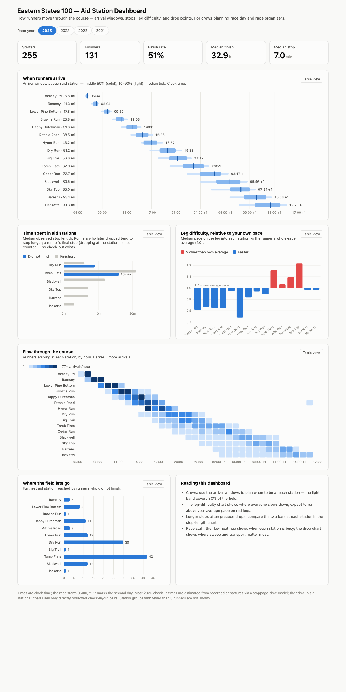

# Aid-Station Dashboard — Reader's Guide

*What each chart on `data/08_reporting/es_as_dashboard.html` shows, how to read
it, and the honesty rules baked into the display.*



## The page at a glance

The dashboard is a **single self-contained HTML file** — inline CSS, JS, and
SVG, no external libraries or network calls — so it can be dropped onto the
race website (or emailed) as one file. It is rebuilt by the `reporting`
pipeline from `es_interval_features`:

```bash
uv run kedro run --pipeline reporting
open data/08_reporting/es_as_dashboard.html
```

Two audiences, one page: **crews** planning where and when to meet their
runner, and **race staff** understanding how the field moves through the
course.

Everything on the page is scoped by the **race-year pills** at the top
(2021/2022/2023/2025 — the race didn't run in 2020/2024, and 2016–2017 lack
the departure data these charts need). There is deliberately no "all years"
option: the aid-station layout changed between editions, so mixing years would
compare different courses.

Every chart has a **Table view** button (the exact numbers, no hovering
required), hover **and keyboard-focus tooltips** on every mark, and a dark
theme that follows the reader's system setting.

## KPI row

Five tiles set the context for the selected year: **Starters**, **Finishers**,
**Finish rate**, **Median finish** (hours), and **Median stop** (minutes,
observed stops only). Example — 2025: 255 starters, 131 finishers (51%),
median finish 32.9 h, median stop 7 min.

## When runners arrive

*One row per aid station, on a clock-time axis. The race starts 05:00; "+1"
marks the second day.*

- the **thin light band** spans the 10th–90th percentile of arrivals — 80% of
  the field arrives inside it;
- the **thicker solid band** is the middle 50%;
- the **dark tick** is the median, with its clock time labeled at the row end.

**For crews**: this is the planning chart. If your runner is mid-pack, be at
the station around the tick; if they're chasing cutoffs, be there from the
right edge of the light band. Example — 2025 Dry Run (51.2 mi): median arrival
19:38, 80% of the field between 16:41 and 21:56.

Most 2025 arrival times are estimated from recorded departures via the
stoppage-time model (see `stoppage_model.md`); the bands absorb that ±4-minute
uncertainty without visible effect at this scale.

## Time spent in aid stations

*Median stop length per station: blue = runners who eventually dropped,
gray = finishers.*

Across 2021–2023, runners who later dropped stop longer than finishers at
most stations (23 of 32 station-cohort comparisons), typically by 1–3 minutes
of median — a real but modest "beware the chair" signal. The pattern inverts
at planned resupply stops: at Tomb Flats (62.9 mi, the gateway to the night)
2025 *finishers* held the longer median (21 min vs 16) — a deliberate refuel,
not a warning sign.

Three honesty rules shape this chart:

1. Only **directly observed** check-in/out pairs count — no imputed stops.
2. A runner's *final* stop is invisible here: dropping at a station means no
   check-out, so the sit that preceded the DNF is structurally excluded. The
   blue bars describe DNF runners *passing through*, not dropping.
3. A station appears only when observed pairs cover **≥ 30% of its visits**.
   In 2025 the sparse arrival recording leaves a biased subset at some
   stations (the few runners whose arrival got logged are often exactly the
   ones who stopped long — one station's "median" read 55 min from 27 such
   runners), so unreliable stations are suppressed rather than shown wrong.

## Leg difficulty, relative to your own pace

*One column per leg (labeled by the station the leg arrives at), centered on
1.0 = the runner's own whole-race average pace.*

For each runner we divide their pace on a leg by their overall pace, then take
the median across the field — so the chart is course difficulty with fitness
factored out. **Red bars (> 1.0)** are legs where nearly everyone runs slower
than their own average: the night climbs into Cedar Run through Sky Top run
×1.05–×1.2. **Blue bars (< 1.0)** are faster-than-average terrain — the early
road-ish miles.

**For runners and crews**: on a red ×1.15 leg, expect your split to run ~15%
slower than your average pace — that's the honest way to project arrival times
leg by leg.

Legs that span an unrecorded station are excluded from the medians
(`spans_missing_as` flag), so each column reflects genuine single-leg efforts.

## Flow through the course

*A heatmap: stations top-to-bottom in course order, race clock left-to-right,
darker = more runners arriving that hour.*

Read it as the field's wave moving down and to the right — tight and fast at
the first stations, spreading as the race stretches the pack, thinning after
the drop stations. **For race staff** this is a staffing chart: it shows when
each station is busy, when the last arrivals trail through, and how the
overnight stations carry a much longer duty window than the morning ones.

The color scale caps at the 95th percentile of non-zero cells (legend shows
"N+"): the first station sees essentially the whole field inside one hour, and
without the cap that single cell would flatten every other row to the palest
step.

## Where the field lets go

*For each non-finisher, the furthest station they reached; bars count runners
per station.*

Drops cluster where the course is long, remote, and dark — in 2025, **Tomb
Flats (62.9 mi) is the big one with 42 drops**, followed by Dry Run (51.2 mi)
with 30. **For race staff**: these are the stations where sweep coverage,
transport capacity, and a warm place to sit matter most. **For runners**: if
you make it through Tomb Flats moving, history says your odds improve sharply.

## Reading this dashboard (the on-page card)

A short cheat-sheet card repeats the key reading rules for visitors who arrive
at the page without this guide.

## Design & accessibility notes

- Colors come from a validated palette (colorblind-safety checked
  programmatically in both light and dark modes); identity is never carried by
  color alone — every multi-series chart has a legend, and every chart has a
  table view.
- Tooltips appear on keyboard focus as well as hover; no value is reachable
  only by pointer.
- Dark mode is a deliberately chosen second palette (not an automatic
  inversion) and follows `prefers-color-scheme`, with `data-theme` overrides
  supported for embedding sites that have their own toggle.
- The template lives at
  `src/eastern_states_pace_predict/pipelines/reporting/template.html`; the
  per-year aggregates are computed in `nodes.py` next to it and injected as a
  single JSON blob at build time.

## Caveats to keep in mind

- 2025 arrival times are largely model-estimated (departures were what the
  timing system captured); stoppage displays use observed pairs only.
- Station groups with fewer than 5 runners are suppressed everywhere.
- The finish line is absent from the 2025 split data, so 2025 charts end at
  the last aid station (99.3 mi), not the finish arch.
