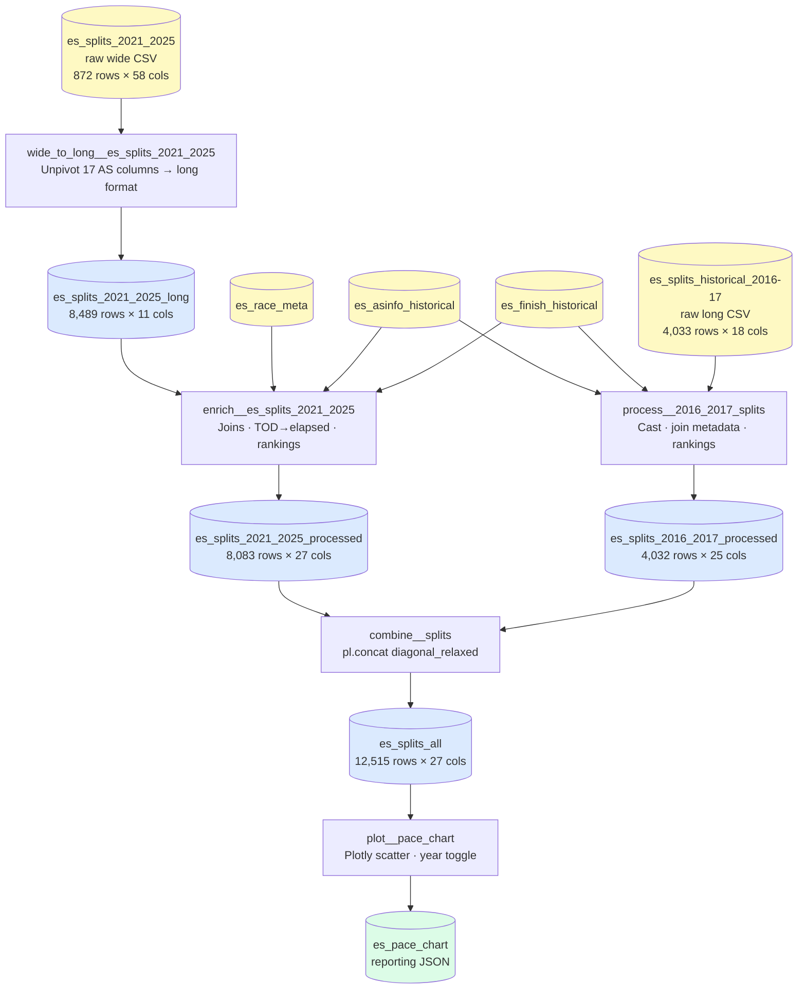
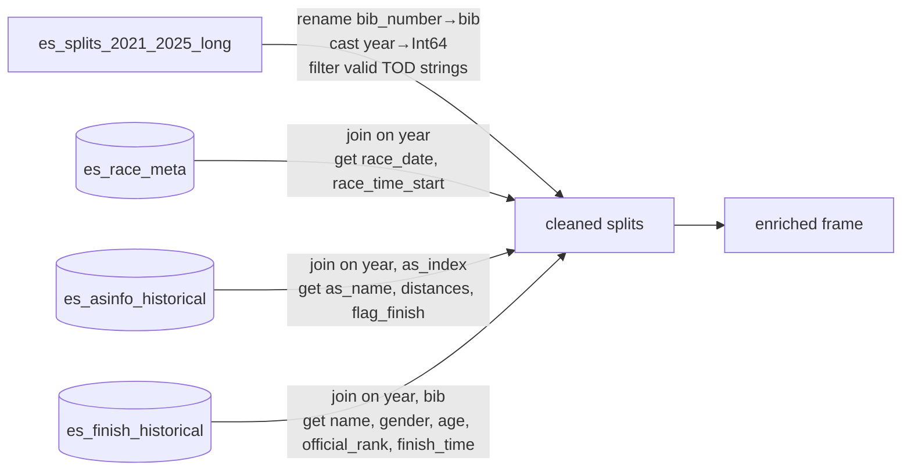
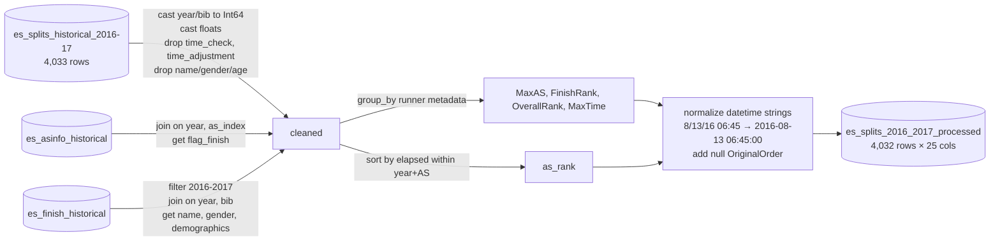

# ES100 Data Processing Pipeline — Walkthrough

This document traces the journey from raw timing files to the unified `es_splits_all` dataset. It covers the structure of each input, what the pipeline does at each stage, and a line-by-line explanation of the most complex transformation: converting time-of-day strings to elapsed times while handling midnight rollovers and data-entry errors.

---

## 1. Data Sources

The pipeline ingests five raw files. Three are reference tables; two contain the actual split times from different eras of the race.

### 1a. Split Times: 2021–2025 (Wide Format)

**File:** `data/01_raw/ES100_2021-2025_splits.csv`  
**Shape:** 872 rows × 58 columns  
**One row per runner.** Split times for each of 17 aid stations are stored as separate columns.

| year | bib_number | OriginalOrder | MaxAS  | FinishRank | as01_arr_tod | as01_dep_tod | as01_arr_rank | as02_arr_tod | as02_dep_tod |
|------|-----------|---------------|--------|------------|--------------|--------------|---------------|--------------|--------------|
| 2021 | 335       | 20            | FINISH | 1          | 06:02        | null         | 7             | 07:19        | null         |
| 2021 | 389       | 25            | FINISH | 2          | 06:00        | null         | 3             | 07:16        | null         |
| 2021 | 246       | 2             | FINISH | 3          | 06:10        | null         | 9             | 07:18        | null         |

All values load as strings (`infer_schema_length: 0`). The metadata columns `MaxAS`, `FinishRank`, `OverallRank`, `MaxTime`, and `OriginalOrder` are pre-populated for 2021–2023 runners but missing for 2025 — they get recomputed from scratch during enrichment.

### 1b. Split Times: 2016–2017 (Long Format)

**File:** `data/01_raw/es100_2016-2017.csv`  
**Shape:** 4,033 rows × 18 columns  
**One row per runner × aid station.** Elapsed times are already pre-computed. Time-of-day (`as_check_in__tod`) is generally absent (blank), but `as_check_in__tod__datetime` and `as_check_in__elapsed__min` are populated.

| year | bib | as_index | as_name      | as_check_in__tod__datetime | as_check_in__elapsed__min | as_dist_from_start | time_check |
|------|-----|----------|--------------|---------------------------|---------------------------|--------------------|-----------|
| 2016 | 1   | AS_01    | RAMSEY RD    | 8/13/16 06:45             | 1.75                      | 5.8                | null      |
| 2016 | 1   | AS_02    | RAMSEY       | 8/13/16 08:36             | 3.6                       | 11.3               | null      |
| 2016 | 2   | AS_01    | RAMSEY RD    | 8/13/16 06:28             | 1.4667                    | 5.8                | null      |

`as_check_in__elapsed__min` stores **decimal hours** (1.75 = 1 h 45 min) despite the "min" suffix — this is an inherited naming convention from the source data. Two columns present here (`time_check`, `time_adjustment`) have no equivalent in the 2021–2025 schema and are dropped.

### 1c. Reference Tables

**`es_race_meta`** — one row per race year, used to anchor TOD values to a real calendar date:

| race_year | race_date  | race_time_start |
|-----------|-----------|-----------------|
| 2016      | 2016-08-13 | 05:00           |
| 2021      | 2021-08-14 | 05:00           |
| 2022      | 2022-08-13 | 05:00           |

**`es_asinfo_historical`** — one row per year × aid station, provides distances and a finish flag:

| year | as_index | as_name           | dist_from_start | as_dist | flag_finish |
|------|----------|-------------------|-----------------|---------|-------------|
| 2021 | AS_01    | Ramsey Rd         | 5.8             | 5.8     | false       |
| 2021 | AS_02    | Ramsey            | 11.3            | 5.5     | false       |
| 2021 | AS_18    | Finish            | 103.1           | 5.6     | true        |

**`es_finish_historical`** — official finish-line results, used to enrich split data with demographics and ranks:

| race_year | bib | name           | gender | age | official_rank | finish_time | finish_elapsed_hrs |
|-----------|-----|----------------|--------|-----|---------------|-------------|-------------------|
| 2021      | 335 | BEN QUATROMONI | M      | 33  | 1             | 22:31:28.2  | 22.524            |
| 2021      | 389 | NICOLE YOKUM   | F      | 38  | 2             | 24:34:14.3  | 24.571            |

---

## 2. Pipeline Overview



---

## 3. Step 1 — Wide to Long (2021–2025 only)

The 2021–2025 source file has 17 pairs of columns per aid station (`asNN_arr_tod`, `asNN_dep_tod`, `asNN_arr_rank`). Each runner occupies a single row. The node unpivots these into one row per runner × aid station.

**Before (one row per runner):**

| year | bib | as01_arr_tod | as01_dep_tod | as01_arr_rank | as02_arr_tod | as02_dep_tod |
|------|-----|--------------|--------------|---------------|--------------|--------------|
| 2021 | 246 | 06:10        | null         | 9             | 07:18        | null         |

**After (one row per runner × AS):**

| year | bib_number | as_index | as_check_in__tod | as_check_out__tod | arr_rank | FinishRank | MaxAS  |
|------|-----------|----------|------------------|-------------------|----------|------------|--------|
| 2021 | 246       | AS_01    | 06:10            | null              | 9        | 3          | FINISH |
| 2021 | 246       | AS_02    | 07:18            | null              | 5        | 3          | FINISH |
| 2021 | 246       | AS_03    | 08:37            | 08:43             | 5        | 3          | FINISH |

Rows where `as_check_in__tod` is null after unpivoting are filtered out — those represent aid stations the runner never reached. The result is 8,489 rows across all five years.

---

## 4. Step 2 — Enrich 2021–2025

This node transforms the long-format split data into a fully enriched dataset by joining three reference tables and computing elapsed times, datetimes, and rankings from scratch.

### 4a–4c. Joins



A pre-filter removes five rows where `as_check_in__tod` was the literal string `"DNF"` rather than null — a data-entry artefact in the source file. Bib numbers with trailing asterisks (e.g., `"545*"`) have the asterisk stripped before the integer cast.

### 4d. TOD → Elapsed Conversion (Deep Dive)

This is the most complex part of the pipeline. The source data records aid station check-in times as **time-of-day (TOD)** strings in `HH:MM` format — for example `"06:10"` or `"01:19"`. These have no date component. The goal is to convert each TOD into:

1. A full **datetime** (`as_check_in__tod__datetime`) anchored to the correct calendar date
2. A **decimal hours elapsed** value (`as_check_in__elapsed__min`) since the 05:00 race start

The complication: the race runs up to 36 hours. Runners who are still on course at midnight show a TOD that appears to go *backward* (e.g., `23:59` → `01:19`). Additionally, a small number of check-in times were entered with an AM/PM error: a time like `01:19` was meant to be `13:19` (1 PM), not 1 AM the next morning.

The algorithm handles both cases in a single chain of `with_columns` calls. Here is each step explained, using bib 286 from 2021 as a worked example.

---

#### Setup: What We Start With

After the joins in steps 4a–4c, each row has:
- `as_check_in__tod`: a string like `"06:10"` or `"01:19"`
- `race_start_datetime`: a Polars Datetime (2021-08-14 05:00:00)

The frame is sorted by `["year", "bib", "as_index"]` so rows are in station order.

---

#### Sub-step 1 — Convert TOD string to seconds since midnight

```python
def _tod_to_seconds(col: str) -> pl.Expr:
    parts = pl.col(col).str.splitn(":", 2)
    return (
        parts.struct.field("field_0").cast(pl.Int64) * 3600
        + parts.struct.field("field_1").cast(pl.Int64) * 60
    )

df = df.sort(["year", "bib", "as_index"]).with_columns(
    _tod_to_seconds("as_check_in__tod").alias("_arr_s"),
    pl.col("race_start_datetime").dt.truncate("1d").alias("_race_midnight"),
)
```

`str.splitn(":", 2)` splits `"06:10"` into a Polars `Struct` with two fields. `.struct.field("field_0")` extracts `"06"`, cast to Int64 → 6. Multiply by 3600 → 21,600. Add minutes × 60. Result: `_arr_s` is seconds elapsed since midnight on race day.

`dt.truncate("1d")` truncates a datetime to the start of its day. `2021-08-14 05:00:00` → `2021-08-14 00:00:00`. This is the anchor point for all subsequent arithmetic. Using midnight (not 05:00) is critical: if we added seconds-since-midnight to the 05:00 start time, a check-in at `06:10` (22,200 s since midnight) would produce `2021-08-14 05:00 + 22,200 s = 2021-08-14 11:10`, which is 5 hours wrong.

**Bib 286 after sub-step 1:**

| as_index | as_check_in__tod | _arr_s | _race_midnight      |
|----------|-----------------|--------|---------------------|
| AS_01    | 06:10           | 22,200 | 2021-08-14 00:00:00 |
| AS_02    | 07:22           | 26,520 | 2021-08-14 00:00:00 |
| ...      | ...             | ...    | ...                 |
| AS_11    | 21:41           | 78,060 | 2021-08-14 00:00:00 |
| AS_12    | 23:59           | 86,340 | 2021-08-14 00:00:00 |
| AS_13    | 01:19           | 4,740  | 2021-08-14 00:00:00 |

Note how `01:19` produces only 4,740 seconds — much less than the 86,340 for `23:59`. This is the "backward jump" we need to detect.

---

#### Sub-step 2 — Shift to get the previous row's TOD seconds

```python
.with_columns(
    pl.col("_arr_s")
    .shift(1, fill_value=RACE_START_S)
    .over(["year", "bib"])
    .alias("_prev_arr_s")
)
```

`.shift(1)` shifts the `_arr_s` column down by one row within each `(year, bib)` group, so each row now sees the previous station's arrival seconds. The first row per runner gets `fill_value=RACE_START_S` (18,000 = 05:00), meaning we treat the race start as the "previous" time — this prevents a false crossing being detected at the very first aid station when `AS_01` arrival seconds happen to be less than some other fill value.

`.over(["year", "bib"])` is Polars' window function syntax. It applies the shift independently for each unique `(year, bib)` combination, so the last row of one runner doesn't bleed into the first row of the next.

**Bib 286 after sub-step 2:**

| as_index | _arr_s | _prev_arr_s |
|----------|--------|-------------|
| AS_01    | 22,200 | 18,000 (race start fill) |
| AS_02    | 26,520 | 22,200      |
| ...      | ...    | ...         |
| AS_11    | 78,060 | 73,260      |
| AS_12    | 86,340 | 78,060      |
| AS_13    | 4,740  | 86,340      |  ← backward jump here

---

#### Sub-step 3 — Flag backward jumps

```python
.with_columns(
    (pl.col("_arr_s") < pl.col("_prev_arr_s"))
    .cast(pl.Int32)
    .alias("_is_arr_cross")
)
```

A Boolean expression compares current seconds to previous seconds. When current < previous, the clock appeared to go backward — this indicates either a genuine midnight crossing or an AM/PM data-entry error. Casting to `Int32` (0 or 1) sets up the next cumulative sum.

**Bib 286 after sub-step 3:**

| as_index | _arr_s | _prev_arr_s | _is_arr_cross |
|----------|--------|-------------|---------------|
| AS_01    | 22,200 | 18,000      | 0             |
| ...      | ...    | ...         | 0             |
| AS_12    | 86,340 | 78,060      | 0             |
| AS_13    | 4,740  | 86,340      | **1**         |

---

#### Sub-step 4 — Cumulative crossing count

```python
.with_columns(
    pl.col("_is_arr_cross")
    .cum_sum()
    .over(["year", "bib"])
    .alias("_cross_cum")
)
```

`.cum_sum()` accumulates the crossing flags from the top of each runner's rows downward. The result tells us how many backward jumps have occurred *up to and including* this row.

For bib 286: `_cross_cum` is 0 for AS_01 through AS_12, then becomes 1 at AS_13 and stays 1 for any subsequent rows (there are none here).

This is the variable that distinguishes a **genuine midnight crossing** (`_cross_cum == 1`) from an **AM/PM error** (`_cross_cum >= 2`, meaning a second backward jump occurred after we already moved to day+1).

---

#### Sub-step 5 — Day offset and AM/PM correction

```python
.with_columns(
    pl.col("_cross_cum").clip(upper_bound=1).alias("_arr_day_offset"),
    pl.when(
        (pl.col("_is_arr_cross") == 1) & (pl.col("_cross_cum") >= 2)
    )
    .then(pl.col("_arr_s") + 12 * 3600)
    .otherwise(pl.col("_arr_s"))
    .alias("_arr_s_corr"),
)
```

Two new columns are computed simultaneously in a single `with_columns` call:

**`_arr_day_offset`:** `.clip(upper_bound=1)` caps `_cross_cum` at 1. The race has a hard 36-hour cutoff, so only one genuine midnight crossing is physically possible. Any runner who appears to have crossed midnight twice must have a data-entry error on the second crossing. The day offset stays at 1 for all rows after the first crossing.

**`_arr_s_corr` (corrected seconds):** The `when/then/otherwise` expression identifies the specific row where the second apparent crossing occurred (`_is_arr_cross == 1` AND `_cross_cum >= 2`). Only that row gets 12 hours (43,200 seconds) added to its TOD seconds. The logic is: if we're already on day+1 and the clock appears to go backward, the most likely explanation is the time was entered as `01:19` instead of `13:19`. Adding 12h corrects it without moving to day+2.

The condition `_is_arr_cross == 1` is crucial. Without it, every row after the second crossing would get +12h because `_cross_cum >= 2` stays true for all subsequent rows. We only want to fix the specific row that was entered wrong.

**Example of AM/PM error scenario (hypothetical runner in 2023):**

| as_index | as_check_in__tod | _arr_s | _prev_arr_s | _is_arr_cross | _cross_cum | _arr_day_offset | _arr_s_corr       |
|----------|-----------------|--------|-------------|---------------|------------|-----------------|-------------------|
| AS_10    | 20:01           | 72,060 | 68,400      | 0             | 0          | 0               | 72,060            |
| AS_11    | 22:45           | 81,900 | 72,060      | 0             | 0          | 0               | 81,900            |
| AS_12    | 00:15           | 900    | 81,900      | **1**         | **1**      | **1**           | 900               |  ← genuine midnight crossing
| AS_13    | 11:45           | 42,300 | 900         | 0             | 1          | 1               | 42,300            |  ← fine, no crossing
| AS_14    | 01:03           | 3,780  | 42,300      | **1**         | **2**      | **1** (clipped) | **3,780 + 43,200 = 46,980** |  ← AM/PM error corrected to 13:03
| AS_15    | 02:30           | 9,000  | 3,780       | 0             | 2          | 1               | 9,000             |  ← no change (is_arr_cross=0)

Without the `_is_arr_cross == 1` guard, AS_15 would also receive +12h even though its `_cross_cum` is 2 — that would be wrong.

---

#### Sub-step 6 — Build the final datetime

```python
.with_columns(
    (
        pl.col("_race_midnight")
        + pl.duration(seconds=pl.col("_arr_s_corr"))
        + pl.duration(days=pl.col("_arr_day_offset"))
    ).alias("as_check_in__tod__datetime")
)
```

`pl.duration(seconds=...)` and `pl.duration(days=...)` create Polars Duration expressions from column values. Adding them to the midnight Datetime anchor produces the correct calendar datetime for each check-in.

For bib 286 at AS_13:
- `_race_midnight` = `2021-08-14 00:00:00`
- `_arr_s_corr` = 4,740 (01:19 = 1×3600 + 19×60)
- `_arr_day_offset` = 1

→ `2021-08-14 00:00:00 + 4,740 s + 1 day = 2021-08-15 01:19:00` ✓

For comparison, if we had used `race_start_datetime` (05:00) as the base instead of midnight:
`2021-08-14 05:00:00 + 4,740 s + 1 day = 2021-08-15 06:19:00` — 5 hours too late.

---

#### Sub-step 7 — Compute elapsed from datetime

```python
def _elapsed_hours(dt_col: str) -> pl.Expr:
    return (pl.col(dt_col) - pl.col("race_start_datetime")).dt.total_seconds() / 3600

def _elapsed_hhmmss(dt_col: str) -> pl.Expr:
    total_s = (pl.col(dt_col) - pl.col("race_start_datetime")).dt.total_seconds()
    hours = (total_s // 3600).cast(pl.Int64)
    minutes = ((total_s % 3600) // 60).cast(pl.Int64)
    seconds = (total_s % 60).cast(pl.Int64)
    return pl.concat_str([...])  # "HH:MM:SS"

.with_columns(
    _elapsed_hhmmss("as_check_in__tod__datetime").alias("as_check_in__elapsed"),
    _elapsed_hours("as_check_in__tod__datetime").alias("as_check_in__elapsed__min"),
)
```

Polars Datetime subtraction produces a Duration. `.dt.total_seconds()` converts it to an Int64 of seconds. Dividing by 3600 yields decimal hours — so `as_check_in__elapsed__min` for bib 286 at AS_13 is:

`(2021-08-15 01:19:00 − 2021-08-14 05:00:00).total_seconds() / 3600 = 72,060 / 3600 ≈ 20.32 h`

The temporary columns (`_arr_s`, `_prev_arr_s`, `_is_arr_cross`, `_cross_cum`, `_arr_s_corr`, `_arr_day_offset`, `_race_midnight`) are all dropped at the end of this step.

**Bib 286 — final result of step d:**

| as_index | as_check_in__tod | as_check_in__elapsed__min | as_check_in__tod__datetime   |
|----------|-----------------|--------------------------|------------------------------|
| AS_01    | 06:10           | 1.167                    | 2021-08-14T06:10:00.000000   |
| AS_02    | 07:22           | 2.367                    | 2021-08-14T07:22:00.000000   |
| AS_03    | 08:42           | 3.700                    | 2021-08-14T08:42:00.000000   |
| AS_04    | 10:31           | 5.517                    | 2021-08-14T10:31:00.000000   |
| AS_05    | 11:49           | 6.817                    | 2021-08-14T11:49:00.000000   |
| AS_09    | 17:56           | 12.933                   | 2021-08-14T17:56:00.000000   |
| AS_11    | 21:41           | 16.683                   | 2021-08-14T21:41:00.000000   |
| AS_12    | 23:59           | 18.983                   | 2021-08-14T23:59:00.000000   |
| AS_13    | 01:19           | 20.317                   | **2021-08-15**T01:19:00.000000 |

The AS_13 datetime correctly rolls over to August 15.

---

### 4e–4i. Runner Metadata and Rankings

After the TOD→elapsed conversion, three additional enrichment steps complete the node:

- **Runner-level aggregation** (`group_by(["year", "bib"])`): computes `MaxAS` (furthest station reached), `FinishRank` (official rank or `"DNF"`), `MaxTime` (finish elapsed or furthest-station elapsed for DNFs), and `OverallRank` (ranked by distance then time within each year).
- **Per-AS rank** (`as_rank`): within each `(year, as_index)`, runners are sorted by `as_check_in__tod__datetime` and assigned an integer rank starting at 1.
- **Column selection**: only the 27 columns in the target schema are returned; temporary and source-specific columns are dropped.

---

## 5. Step 3 — Process 2016–2017



Key differences from the 2021–2025 enrichment:
- **No TOD conversion needed.** `as_check_in__elapsed__min` is already present as decimal hours. `as_rank` is derived from it directly rather than from `as_check_in__tod__datetime`.
- **Datetime normalization.** The source uses `"8/13/16 06:45"` format. `str.to_datetime("%m/%d/%y %H:%M").cast(pl.String)` converts to ISO format, matching 2021–2025 output.
- **`OriginalOrder` column** is null for all 2016–2017 rows (this field has no equivalent in the older data).

---

## 6. Step 4 — Combine

```python
pl.concat([df_1617, df_2125], how="diagonal_relaxed")
```

`diagonal_relaxed` is Polars' most permissive concat mode: it aligns columns by name and fills any column present in one frame but absent in the other with nulls. This handles minor schema differences between the two processed datasets (e.g., `as_check_in__tod` is mostly null for 2016–2017; `OriginalOrder` is always null for 2016–2017).

The combined frame is sorted by `["year", "bib", "as_index"]`.

---

## 7. Output: `es_splits_all`

**Shape:** 12,515 rows × 27 columns

| Column | Type | Description |
|--------|------|-------------|
| `year` | Float64 | Race year (2016, 2017, 2021, 2022, 2023, 2025) |
| `bib` | Float64 | Runner bib number |
| `name` | String | Runner name (from finish_times; null for DNFs not in finish data) |
| `gender` | String | M / F |
| `age` | Float64 | Age on race day |
| `city` | String | Hometown |
| `as_index` | String | Aid station ID (AS_01 … AS_18) |
| `as_name` | String | Aid station name |
| `as_check_in__tod` | String | Check-in time of day (HH:MM); null for 2016–2017 |
| `as_check_out__tod` | String | Departure time of day; sparse |
| `as_check_in__elapsed` | String | Elapsed HH:MM:SS since race start |
| `as_check_out__elapsed` | String | Departure elapsed; sparse |
| `race_datetime` | String | Race start datetime string |
| `as_check_in__tod__datetime` | String | ISO datetime of check-in |
| `as_check_in__elapsed__min` | Float64 | **Decimal hours** since race start (e.g., 1.75 = 1h45m) |
| `as_dist_from_start` | Float64 | Miles from start to this station |
| `as_dist_incr` | Float64 | Miles from previous station |
| `MaxAS` | String | Furthest station reached (`"FINISH"` or `"AS_XX"`) |
| `FinishRank` | String | Official finish rank, or `"DNF"` |
| `OverallRank` | Int64 | Rank by distance then time within year |
| `MaxTime` | Float64 | Decimal hours to finish (finishers) or furthest AS (DNFs) |
| `as_rank` | Int64 | Arrival rank at this station within year |
| `official_rank` | Float64 | From finish_times; null for DNFs |
| `finish_time` | String | Official clock time string |
| `finish_elapsed_hrs` | Float64 | Decimal hours to finish |
| `finish_elapsed_mins` | Float64 | Minutes to finish |
| `OriginalOrder` | Float64 | Source row order (2021–2025 only) |

**Sample rows — 2021 race winner (bib 335):**

| year | bib | name           | as_index | as_check_in__elapsed__min | as_dist_from_start | as_rank | FinishRank | OverallRank |
|------|-----|----------------|----------|--------------------------|--------------------|---------|-----------:|------------:|
| 2021 | 335 | BEN QUATROMONI | AS_01    | 1.033                    | 5.8                | 9       | 1          | 1           |
| 2021 | 335 | BEN QUATROMONI | AS_02    | 2.350                    | 11.3               | 6       | 1          | 1           |
| 2021 | 335 | BEN QUATROMONI | AS_03    | 3.583                    | 17.8               | 5       | 1          | 1           |

**Sample rows — 2016 race winner (bib 157):**

| year | bib | name        | as_index | as_check_in__tod__datetime  | as_check_in__elapsed__min | as_dist_from_start | as_rank | FinishRank |
|------|-----|-------------|----------|-----------------------------|--------------------------|--------------------|---------|-----------:|
| 2016 | 157 | DEVON OLSON | AS_01    | 2016-08-13 06:04:00.000000  | 1.067                    | 5.8                | 4       | 1          |
| 2016 | 157 | DEVON OLSON | AS_02    | 2016-08-13 08:08:00.000000  | 2.133                    | 11.3               | 4       | 1          |

**Row counts by year:**

| year | rows |
|------|-----:|
| 2016 | 1,553 |
| 2017 | 2,479 |
| 2021 | 2,112 |
| 2022 | 2,572 |
| 2023 | 2,580 |
| 2025 | 1,219 |
