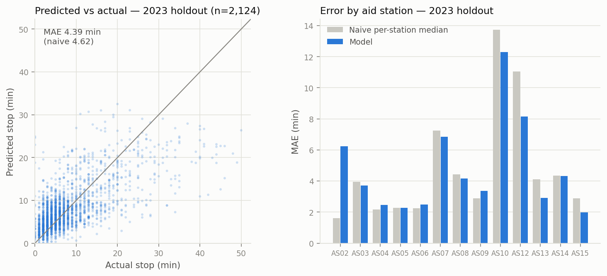

# The Aid-Station Stoppage-Time Model

*How missing 2025 check-in times are imputed, how the model works, and how well
it performs.*

## Why this model exists

The 2025 timing data recorded mostly **departure** times (2,679 departure cells
vs 1,219 arrivals), while 2021–2023 recorded arrivals consistently. To compute
per-leg paces we need both sides of every aid-station visit: pace on a leg runs
from the *departure* out of one station to the *arrival* at the next.

Rather than guessing arrivals directly, we model the quantity that separates the
two timestamps — **`as_stoppage_time` = time spent inside an aid station, in
minutes** — from things we know about the runner and the station. A missing
check-in is then reconstructed as:

```
check_in  = check_out − predicted_stoppage        (2025's dominant case)
check_out = check_in + predicted_stoppage         (stations missing departures)
```

## Training data

Training rows are station visits where **both** check-in and check-out were
observed — no imputed values feed the model:

| Filter | Reason |
|---|---|
| both elapsed times present | the target is their difference |
| stoppage ≥ 0 | ~24 raw timing inversions (departure clocked minutes before arrival) are data errors, not real stops |
| distance < 103 mi | the finish line has no departure |

That yields **~7,100 observed stops**, mostly 2021–2023 plus the 2025 subset
that recorded both sides. Median stop is **5 minutes**; p90 is ~18; the longest
legitimate stop observed is ~2.5 hours.

## Features

Built in `_stoppage_features()`
(`src/eastern_states_pace_predict/pipelines/feature_engineering/nodes.py`);
the list and hyperparameters live in
`conf/base/parameters_feature_engineering.yml`.

| Feature | What it carries |
|---|---|
| `as_num` | which aid station (stop culture varies a lot by station) |
| `as_dist_from_start` | how deep into the race the runner is |
| `elapsed_hrs` | time on course when they hit the station (night stops run long) |
| `overall_pace_min_per_mi` | the runner's whole-race pace — faster runners stop less |
| `age` | demographic signal (nulls pass through as NaN) |
| `gender_code` | M→0, F→1, other/unknown→NaN |
| `is_finisher` | DNF runners linger far longer before dropping |
| `overall_rank_pct` | rank percentile within the year's field |

## Model choice

**`HistGradientBoostingRegressor`** (scikit-learn), `max_iter=300`,
`learning_rate=0.05`, `max_depth=6`, `random_state=42`. Chosen because it:

- handles NaN feature values natively (age/gender have gaps) — no imputation
  pipeline needed for the features themselves;
- captures the interactions that clearly matter (station × time-of-race ×
  cohort) without manual feature crosses;
- trains in under a second on ~7k rows, so retraining on every `kedro run`
  is free.

## Validation & performance

Validation holds out an **entire year (2023)** — a harsher and more honest test
than a random split, because the model must generalize to a race edition it has
never seen. The baseline to beat is the **naive per-station median** stop from
the training years.

| Metric (2023 holdout) | Value |
|---|---|
| Training rows (2021/2022/2025 observed) | 4,953 |
| Validation rows (2023) | 2,124 |
| **Model MAE** | **4.39 min** |
| Naive per-station-median MAE | 4.62 min |
| Median observed stop | 5.0 min |



**How to read this.** The scatter (left) shows the usual regression behavior:
the model is well-calibrated for the bulk of stops (0–15 min) and compresses
the rare hour-long stops toward the middle — those long stops are
runner-specific decisions (naps, crew time, dropping) that no feature fully
predicts. The per-station panel (right) shows where the model earns its keep:
at the long-stop night stations (AS10, AS12 — Halfway House territory) it beats
the naive median by 1–3 minutes, exactly the stations where imputation accuracy
matters most. At early blow-through stations (AS02) the naive median is nearly
unbeatable — everyone stops ~1 minute — and the model's extra flexibility
slightly hurts.

An overall MAE of ~4.4 minutes against a 5-minute median sounds large, but the
error that actually propagates into imputed check-ins is small relative to what
it feeds: leg times between stations run 1–4 **hours**, so a ±4-minute
uncertainty on the stop rarely moves a leg pace by more than a few percent.

## From prediction to imputation

`impute_missing_times()` applies the model only to one-sided rows and adds
guardrails:

1. Predictions are **clipped to [0, 120] minutes** (`prediction:` params).
2. An imputed check-in is **clamped** to
   `[previous station's time, its own check-out]`, so per-runner elapsed
   times stay monotonic by construction.
3. Every touched row is flagged: `check_in_imputed`, `check_out_imputed`,
   `stoppage_imputed` — downstream consumers (and the dashboard) can always
   separate observed from estimated values.

Latest run: **1,924 check-ins** (mostly 2025) and **~1,050 check-outs**
imputed; zero null check-ins remain in `es_splits_2021_2025_imputed`.

## Tracking & reproducibility

Every `kedro run` involving the feature-engineering pipeline logs to MLflow
(experiment `eastern_states_pace_predict`, SQLite backend `mlflow.db`):
flattened hyperparameters and the feature list as params, the MAE/baseline/
sample-size numbers as `stoppage.*` metrics, and the model pickle + metrics
JSON as artifacts. Browse with:

```bash
uv run mlflow ui --backend-store-uri sqlite:///mlflow.db
```

To regenerate the evaluation figure above:

```bash
uv run python docs/make_stoppage_eval_plot.py
```

## Limitations & future work

- **Long stops are under-predicted** (see scatter). If long-stop accuracy
  becomes important (e.g., predicting drops), a classification stage
  ("will this runner stop > 20 min?") would help more than regressor tuning.
- **Train/serve skew on `elapsed_hrs`**: at training time it is the arrival
  hour; when predicting for a departure-only row it is the departure hour. The
  difference is bounded by the stop itself (minutes against a 5–36 h scale).
- **2016–2017 are out of scope** — those years have no departure data at all,
  so there is nothing observed to validate an imputation against.
- The model is refit on **all** observed rows after validation, so the shipped
  pickle is slightly stronger than the holdout numbers suggest.
